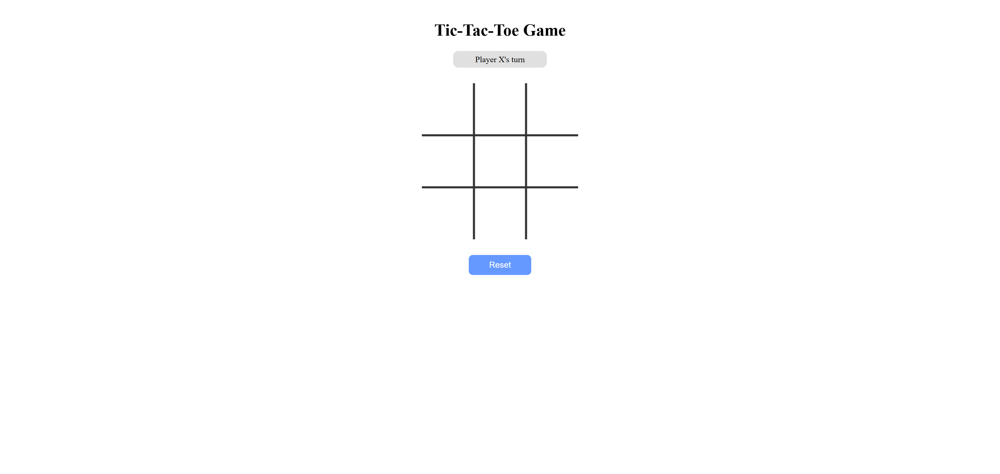

# Play game
Tic-Tac-Toe is a
[Tic-tac-toe](https://en.wikipedia.org/wiki/Tic-tac-toe)
style game.

The game is a turn-based, board-based web application where two players take turns placing their marks on a 3 by 3 board. Player X always starts first, followed by Player O. The game checks for standard Tic-Tac-Toe winning conditions, including horizontal, vertical and diagonal lines.

The current version is implemented in a browser-based web app,
`web-app/index.html`.

This file contains the HTML structure, CSS styling and JavaScript logic required to run the game. The application uses an HTML5 canvas to draw the board and player marks.
The JavaScript code manages the game state, including the current player, board positions, win checking, draw checking and game reset behaviour.

The main game logic is contained inside the `playGame()` function. This function initialises the canvas, stores the board state, draws the game board, handles player clicks, places X and O marks, checks whether a player has won, checks for a draw and updates the status message shown to the user.

The web app includes a simple interface with:

* a game title;
* a status message showing the current player or result;
* a canvas-based Tic-Tac-Toe board;
* a button for starting or resetting the game.

## Installation

* Clone the repository.
* Open `web-app/index.html` in a web browser.
* No additional installation is required for the current browser-based version.

## How to Play

* Click **New Game** to start.
* Player X takes the first turn.
* Players take turns clicking an empty cell on the board.
* The first player to place three marks in a row, column or diagonal wins.
* If all cells are filled and no player has won, the game ends in a draw.
* Click **New Game** again to restart the game.
